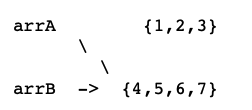

/*
 * Created 2024-05-04 12:45:57
 * Author : fengxuegt
 * Email : fengxuegt@163.com
 */

## 1.1 数据类型和变量
整数类型：byte short int long
小数类型：float double
其他类型：char boolean

变量就是给数据起名字，方便查找不同的数据，值是可以变的

## 1.2 赋值
整数四种数据类型字节大小分别是1、2、4、8

数字常量默认是int类型，所以给long类型变量赋值要加L
小数默认是double类型，因此给float变量赋值要加F

### 1.2.2 数组类型
三种赋值形式：
```java
int [] arr = {1, 2, 3};
int [] arr = new int[] {1, 2, 3};
int [] arr = new int []; // 分配时会有默认值，默认值和数据类型有关，数值类型为0，boolean为false，char为空字符
arr[0] = 1;
arr[1] = 2;
arr[2] = 3;

int arr[] = new int[3]{1, 2,3}; // 这种写法是错误的，因为两个地方给了长度，如果不一致计算机不知道如何处理
```
数组类型变量中存储的是地址，地址引用到真实的数据；因此在做数组变量赋值时，改变的是地址值；



## 1.3 基本运算
### 1.3.1 算数运算
基本算数运算包括加减乘除、取模、++、--
取模只能适用于整数和char
其他运算数值类型和char都适用

**加减乘除注意点**
两个小类型数据相乘可能会发生溢出，因此需要使用适当的数据类型来存储数据；

整数相除不是四舍五入，而是截断；
如果要算小数，则必须有个操作数为小数；

**小数计算结果并不精确**

**自增和自减**
注意先算自己还是后算自己即可

### 1.3.2 比较运算
```shell
> >= < <= == !=
```
注意==判断的是比较地址即可

### 1.3.2 逻辑运算
逻辑运算只可应用于boolean类型变量;
& and && 类似；
| and || 也类似；
只是后者多了短路；
也可用于位运算；
那其实应该是如果是boolean类型那就是逻辑运算，如果是数值类型那就是位运算；

### 1.3.3 位运算
Java中的位运算不常用，但是还是有用的；只能应用于整数类型和字符类型

```
& | ~ << >> >>> ^
```
`>>>`是无符号右移动，左边补0；
`>>`是算数右移动，左边补符号位；

## 1.4 条件执行
switch的case数据类型可以是byte、short、int、枚举、string、char

### 1.4.2 实现原理
条件跳转和无条件跳转
```

```


